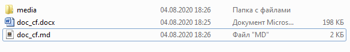

## Подготовка документации

# 1.    Подготовка документа

Первым шагом необходимо подготовить документ в формате **md (markdown)**.

Для этого можно использовать стандартные средства MS Word или Google.docs.

Сохраним наш документ в формате **md**:

При сохранении md-файла, у нас автоматически сохранились все картинки,
содержащиеся в docx-файле, в папку media.

Названия файлов представлены в виде хэша:

Теперь необходимо переименовать их в удобочитаемый формат:

Перед загрузкой файлов в wiki, необходимо отредактировать сам md-файл и
прописать в ссылках измененные названия картинок. Открыть md-файл можно в любом
редакторе кода (я для этого использую SublimeText) или в любом онлайн-редакторе
markdown.

На скриншоте под цифрой 1 изображена ссылка на картинку, сгенерированная MS
Word, а под цифрой **2** изображен **корректный вариант ссылки**,
отредактированный вручную.

Далее вручную правим текст md-файла, согласно синтаксису markdown.

В конечном варианте у вас должно получиться нечто похожее:

