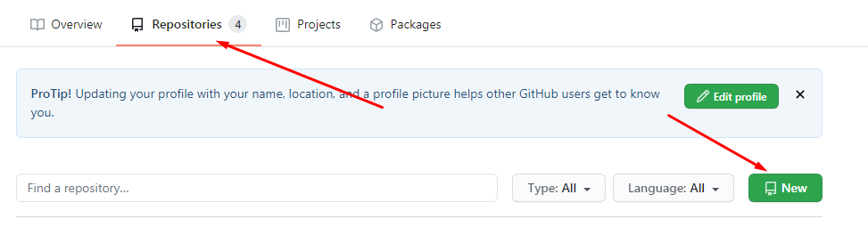

# Настройка git-pages

## Создание репозитория:

Залогинимся в нашем аккаунте github. На вкладке «Repositories» выберем «New»:

Введем название нового репозитория и выберем настройки приватности:

## Первый коммит:

Нам необходимо сделать первый коммит в репозиторий, прежде чем появится
возможность активировать git-pages.

В папке с подготовленными md-файлами вызовем командную строку Git. Для загрузки
файлов в репозиторий необходимо выполнить следующие команды:

Инициализация локального репозитория (выполняется только 1 раз):

git init

Добавляем файлы для загрузки в репозиторий:

git add .

Готовим коммит:

Git commit –m "Комментарий к коммиту"

git remote add origin git\@github.com:larshin-oleg/git-pages.git

Адрес репозитория смотрим в на вкладке "Code"

Загружаем файлы в репозиторий командой:

git push origin master

## Активация git-pages:

Для включения git-pages перейдем в настройки репозитория. В разделе "Options"
найдем раздел «GitHub Pages» и выберем ветку, которая будет отображаться в
git-pages (в нашем случае это ветка master).

После применения настроек видим адрес, на котором располагается наша
документация:

Для перехода к документации необходимо приписать в конец адреса название нашей
стартовой страницы. В моем случае полный адрес выглядит так:

<https://larshin-oleg.github.io/git-pages/Home>
