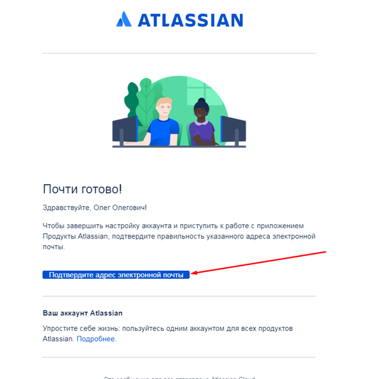
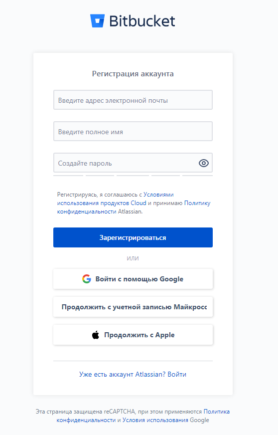
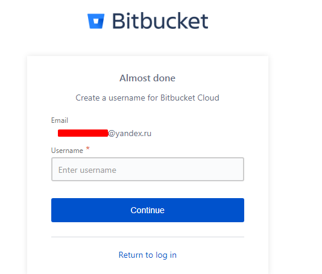
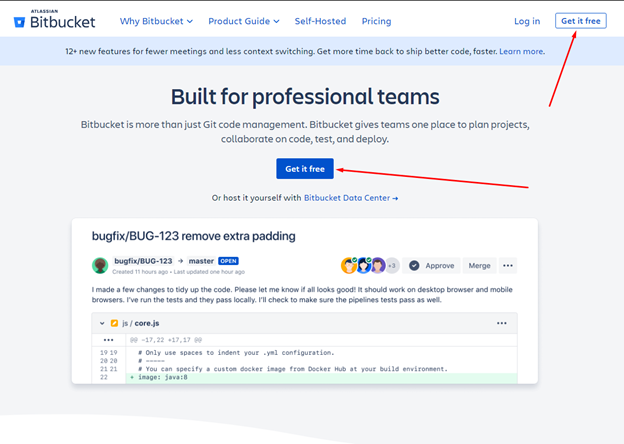

##Регистрация на Bitbucket

Зарегистрировать аккаунт можно на главной странице Bitbucket:

<https://bitbucket.org/product/>

Переходим в раздел регистрации:

Далее вносим учетные данные, которые будут использованы для доступа в Bitbucket.

Можно зарегистрироваться с использованием Email, аккаунта Google, учетной записи
Microsoft или с учетной записью Apple.

В случае, если аккаунт создавался с использованием адреса электронной почты,
необходимо подтвердить регистрацию.

Осталось только придумать логин для доступа к репозиторию.

Далее сервис предложит пройти короткий опрос. Его можно пройти по желанию.